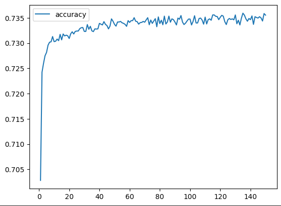
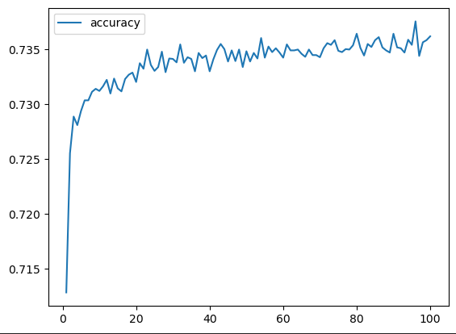
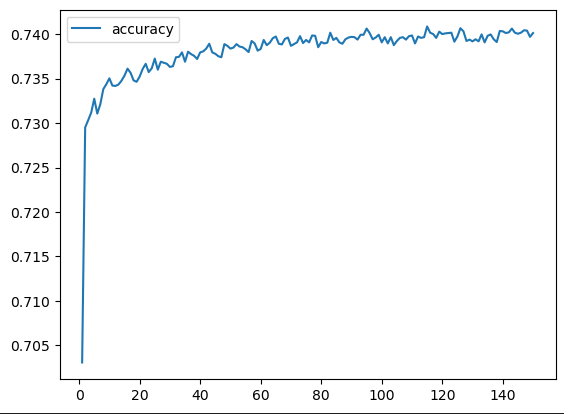

# Deep-Learning-Challenge

# Overview
Alphabet Soup, a non-profit foundation, seeks a solution to aid in the selection of successful applicants for its funding programs. To achieve this objective, we aim to harness the power of advanced data analytics and machine learning algorithms. By analyzing the provided data, our goal is to create a predictive model that can accurately identify candidates who are likely to succeed if granted financial support from Alphabet Soup.

# Results

## Data Preprocessing
Using Pandas we can import the [data](Resources/charity_data.csv) provided we can start by a visual analysis of the data to start preprocessing. These are the steps taken:

- Dropping unnecessary columns such as `EIN` and `NAME`
- Defining Target Variable as `IS_SUCCESSFUL`
- Defining Feature Variables as the remaining columns
- Defining Data Points for columns that had more than ten (10) unique values, such as `APPLICATION_TYPE` and `CLASSIFICATION`
- Creating a bin of values for both `APPLICATION_TYPE` and `CLASSIFICATION` with cutoffs of under 500 for `APPLICATION_TYPE` and under 1000 for `CLASSIFICATION`. These values are stored in a value called `OTHER`
- Convert categorical data into binary columns using `pd.get_dummies()`
- Train and scale the data using `train_test_split()` and `StandardScaler()`

## Compiling, Training, and Evaluating the Model
Target performance is 75% and greater accuracy. 

### Model #1
First model used resulted in 72.61% 

- Inputs: 43 (len(X_test_scaled[0]))
- Layer 1: 6 neurons, activation: `relu`
- Layer 2: 15 neurons, activation: `relu`
- Epochs: 150

### Model #2
Second model used resulted in 72.44%

- Changed `CLASSIFICATION` bin cutoff from 1000 to 400
- Inputs: 43 (len(X_test_scaled[0]))
- Layer 1: 6 neurons, activation: `relu`
- Layer 2: 15 neurons, activation: `relu`
- Layer 3: 24 neurons, activation: `relu`
- Epochs: 100

### Model #3
Third model used resulted in 72.73%

This model we `keras_tuner` to create a model with hyperparameter options. Our specifications for this model were:

- Activation: `relu`, `tanh`, `sigmoid`
- First Layer: Min Value: 1, Max Value: 10
- Hidden Layers: Min Value: 1, Max Value: 30
- Max Epochs: 50
- Step: 2
- Hyperband Iterations: 3

Note that this model took 62 minutes and 36 seconds to run. so grab a coffee. Once this was completed we took our best Hyperparameter and made a model to train.

- Inputs: 43 (len(X_test_scaled[0]))
- Layer 1: 9 neurons, activation: `relu`
- Layer 2: 15 neurons, activation: `relu`
- Layer 3: 15 neurons, activation: `relu`
- Layer 4: 17 neurons, activation: `relu`
- Layer 5: 19 neurons, activation: `relu`
- Layer 6: 13 neurons, activation: `relu`
- Layer 7: 13 neurons, activation: `relu`
- Epochs: 150

## Summary
The three models all showed an accuracy of 72%, this states that the predicted values are aligned with 72% of the original dataset. What pains me is that even when we were presented with the best hyperparameter to use we still had an accuracy score of 72%

## Tools and Technologies 
- Sci-Kit Learn
- Pandas
- Tensorflow
- Keras-Tuner
- Matplotlib